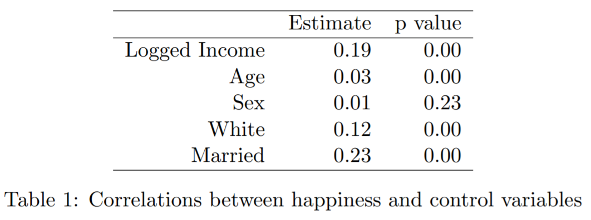
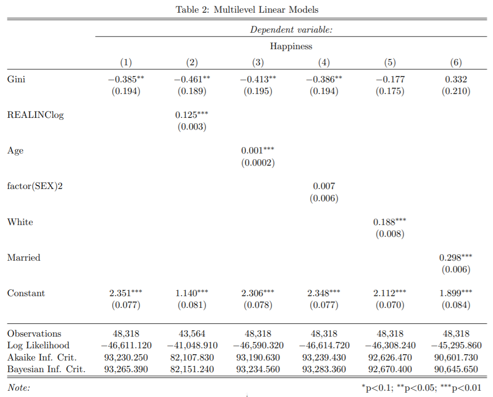

``` {r setup, echo = FALSE, message = FALSE, warnings = FALSE}
knitr::opts_chunk$set(
  collapse = TRUE,
  warning = FALSE,
  message = FALSE,
  echo = FALSE,
  comment = "#>",
  fig.path = "../figures")

knitr::read_chunk("001-creates-table-1.R")
knitr::read_chunk("002-creates-table-2.R")

# load packages
library(tidyverse)
library(gssr)
```

A reference implementation of:

> Grunberg, Rebecca L., Hyejun Kim, and Minjae Kim. 2014a. “Marriage and Happiness Grunberg Kim Kim.pdf.” Harvard Dataverse. https://doi.org/10.7910/DVN/25655/MB980L

Which is a reference implementation of:

> Oishi, S., Kesebir, S., & Diener, E. (2011). Income Inequality and Happiness. Psychological Science, 22(9), 1095–1100. https://doi.org/10.1177/0956797611417262

The purpose of the following paper is to do a replication of the paper "Marriage and happiness: Providing evidence against a relationship between inequality and happiness in Oishi, Kesebir, and Diener (2011)" [@marriagehappiness]. There is a crisis of reproducibility and replication in data science field. This paper follows the ReScience method of replicating a research paper to further validate the results of the paper. This particular replication is unique, because the paper being replicated is actually an alternate implementation of another paper, "Income Inequality and Happiness" [@incomeinequality]. While the first paper draws a connection between happiness and income, the second paper calls in the question the data used for this conclusion, and pulls in additional data for analysis. This second analysis, focused more on marriage and happiness is what this paper seeks to replicate.

# Introduction


```{r get_data, echo = FALSE}
# ==== Get Data
# The happiness, race, and marital data comes from the gssr package and not the provided data since the provided version
  # does not have race or marital status. For more information, go to https://kjhealy.github.io/gssr/
data(gss_all)

# The Gini indices come from the provided dataset
gini <-  read.csv("../data/Gini_families.csv") %>%
  select(year = Year, gini = Total)

# ==== Clean data
# Subset the GSS data to just the relevant fields
gss <- gss_all %>%
  select(year, happy, race, marital) %>%
  mutate(year = as.integer(year), # fix data class
         happy = as.integer(happy),
         happy = recode(happy, `1`= 3, `2` = 2, `3` = 1), # reverse the values such that higher is more happy
         race = as.integer(race),
         marital = as.integer(marital)) %>%
  na.omit() # remove NAs (4780/64,814 cases where not all data was collected)
  
# join the gini and happiness/race/marital data
happy <- gini %>%
  left_join(gss, by = c("year" = "year")) %>%
  na.omit()


# create summary table by year
happy_race_summary <- happy %>%
  group_by(year, race) %>%
  summarize(happy_avg = mean(happy))

# write a function 

```

```{r plots}
g <- ggplot(happy_race_summary, aes(x = year, y = happy_avg, color = factor(race)))
g + geom_point() +
  geom_line(stat = "smooth",
            method = "lm", 
            se = FALSE, 
            alpha = 0.5) +
  theme_bw() +
  labs(title = "Figure 3",
       x = "Year",
       y = "Mean Happiness",
       caption = "Figure 3") +
  scale_color_discrete(name="Race",
                      breaks=c(1, 2, 3),
                      labels=c("White", "Black", "Other")) +
  scale_y_continuous(limits = c(1.9,2.5))


```


# Methods

```{r, echo = FALSE}

myfunction <- function(arg1, arg2){
  print(seq(arg2))
  print("hello world")
}

myfunction(32,44)

```

# Results

```{r import-and-clean-the-data-for-table-1, eval=TRUE}
```

```{r create-the-correlations-and-table, eval=TRUE}
```

```{r display-table-1, eval=TRUE, results='asis'}
```

```{r, table1, fig.cap="Table 1 from the original paper", echo=FALSE}

```

The results from Table 1 in the original paper are shown in Figure \@ref(fig:table1).


```{r, table2, fig.cap="Table 2 from the original paper", echo=FALSE}

```

The results from Table 2 in the original paper are shown in Figure \@ref(fig:table2).


# Conclusion


# References Cited

Reference 1: @marriagehappiness  
Reference 2: @data
Reference 3: @incomeinequality

---

