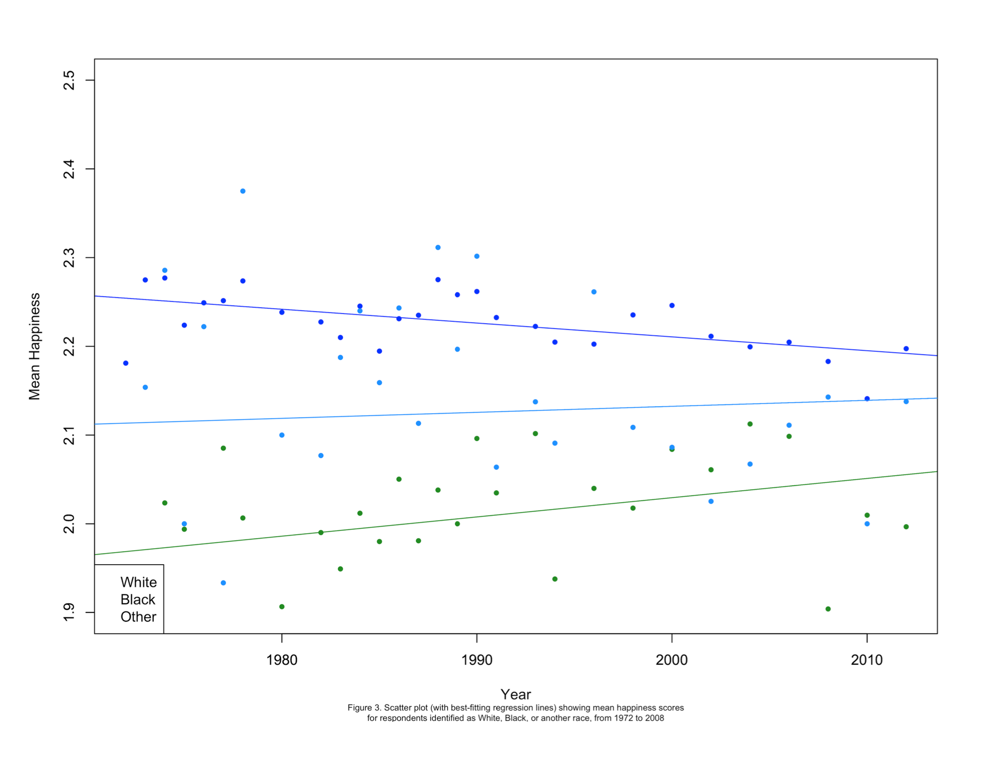
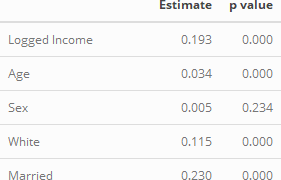
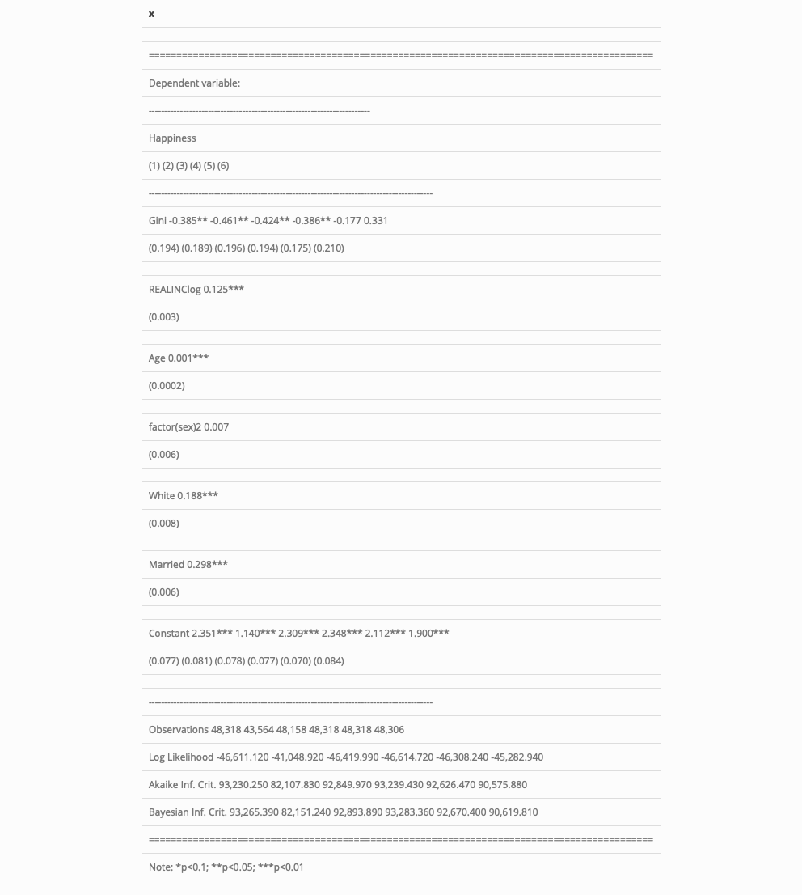

``` {r setup, echo = FALSE, message = FALSE, warnings = FALSE}
knitr::opts_chunk$set(
  collapse = TRUE,
  warning = FALSE,
  message = FALSE,
  echo = FALSE,
  comment = "#>",
  fig.path = "../figures")

knitr::read_chunk("001-creates-table-1.R")
knitr::read_chunk("002-creates-table-2.R")

# load packages
library(tidyverse)
library(gssr)
```

A reference implementation of:

> Grunberg, Rebecca L., Hyejun Kim, and Minjae Kim. 2014a. “Marriage and Happiness Grunberg Kim Kim.pdf.” Harvard Dataverse. https://doi.org/10.7910/DVN/25655/MB980L

Which is a reference implementation of:

> Oishi, S., Kesebir, S., & Diener, E. (2011). Income Inequality and Happiness. Psychological Science, 22(9), 1095–1100. https://doi.org/10.1177/0956797611417262

There is a crisis of reproducibility and replication in the data science field. In an attempt to bolster confidence in scientific results, the following paper is a replication of "Marriage and happiness: Providing evidence against a relationship between inequality and happiness in Oishi, Kesebir, and Diener (2011)" [@marriagehappiness].  This paper follows the ReScience replication method[@rescience] which strongly encourages open source practices as underlined by the format of this project: a github compendium. This particular replication is unique in that the paper being replicated is an alternate implementation of the paper:"Income Inequality and Happiness" [@incomeinequality]. While the first paper draws a connection between happiness and income, the second calls into question the data used to obtain the results stated, and pulls in additional data to re-assess the analysis. This second analysis, which focused on the relationship between marriage and happiness, is the subject of replication in this paper.

# Introduction

In the spirit of reproducible science, a replication of the paper "Marriage and happiness: Providing evidence against a relationship between inequality and happiness in Oishi, Kesebir, and Diener (2011)" [@marriagehappiness] is conducted according to the ReScience standards. ReScience defines replication as:

>"a scientific study (computational or other) means repeating a published protocol, respecting its spirit and intentions but varying the technical details. For computational work, this would mean using different software, running a simulation from different initial conditions, etc. The idea is to change something that everyone believes shouldn’t matter, and see if the scientific conclusions are affected or not" [@rescience].

This replication is unique because it is a replication of a replication. The first paper, "Income Inequality and Happiness" [@incomeinequality], is a study on happiness and specifically focuses on income equality. The study makes the conclusion that in years where there is greater income inequality in America, people are less happy. The paper attributes this negative relationship to meta variables such as perceived trust and perceived fairness in society. The second paper [@marriagehappiness] calls into question the data and the conclusions used by this study. The second paper replicates the first factoring in additional data like race, gender, and marriage to test for possible confounding variables. Most noteably, a relationship between marital status (single vs married) results in the only significant factor of a linear regression using all variables. In essence, the second paper makes the claim that when controlling for marriage, there is no relationship between income inequality and the happiness of Americans - invalidating the first paper's results.

This paper will now be a second replication, focused on critiquing the methods and traceability of the second paper. Throughout the analysis, some critical pieces of missing data led to challenges in reproducing the results. In an effort to reproduce results, we had to find our own data and sources to tie in for the analysis.

```{r get_data, echo = FALSE}
# ==== Get Data
# The happiness, race, and marital data comes from the gssr package and not the provided data since the provided version
  # does not have race or marital status. For more information, go to https://kjhealy.github.io/gssr/
data(gss_all)

# The Gini indices come from the provided dataset
gini <-  read.csv("../data/Gini_families.csv") %>%
  select(year = Year, gini = Total)

# ==== Clean data
# Subset the GSS data to just the relevant fields for the relevant time frame, join, and recode the same way the 
  # original study does
study_data <- gss_all  %>%
  select(year, happy, race, marital) %>%
  filter(year <= 2012) %>%
  mutate(year = as.integer(year),
         happy = dplyr::recode(as.integer(happy), `1`= 3L, `2` = 2L, `3` = 1L)) %>% #recode to increasing happiness from 1 to 3
  left_join(gini, by = c("year" = "year"))

# Relabel the labels attribute to reflect the inverse of the happiness intensity (not actually used, but prolly good)
attributes(study_data$happy)$labels <- c("NOT TOO HAPPY" = 1, "PRETTY HAPPY" = 2, "VERY HAPPY" = 3)

# Create summary table of mean happiness by year by race
race_summary <- study_data %>%
  group_by(year, race) %>%
  dplyr::summarize(happy_avg = mean(na.omit(happy))) # we can remove the 'dplyr' once we only have the tidyverse loaded

# Function to demonstrate that we can write a function.  In this case, this function creates a neat ggplot based on
  # input for the data, x and y axes, factor, title, and x and y labels
study_plotter <- function(plot_data, x_input, y_input, factor_input,
                          factor_title_input = factor_input,
                          factor_labs_input = NULL,
                          title_input = paste0("Plot of ", x_input, " by ", y_input), 
                          xlab_input = x_input, 
                          ylab_input = y_input,
                          caption_input = NULL,
                          ylim_input){
  
  # Evaluate the combination of the data and the x_input, y_input, and factor_input (allows for dynamic plotting)
  x_input_eval <- eval(parse(text = paste0(plot_data, "$", x_input)))
  y_input_eval <- eval(parse(text = paste0(plot_data, "$", y_input)))
  factor_input_eval <- eval(parse(text = paste0(plot_data, "$", factor_input)))
  
  # Set plot params
  g <- ggplot(eval(as.name(plot_data)), aes(x = x_input_eval, y = y_input_eval, color = factor(factor_input_eval)))
  
  # add plot elements and plot
  g + geom_point(size = .6) +
    geom_line(stat = "smooth",
              method = "lm", 
              se = FALSE, 
              alpha = 0.5) +
    theme_bw() +
    labs(title = title_input,
         x = xlab_input,
         y = ylab_input,
         caption = caption_input) +
    scale_color_manual(values=c("blue", "forestgreen", "dodgerblue"),
                       name=factor_title_input,
                       breaks=c(1, 2, 3),
                       labels=factor_labs_input) +
    coord_cartesian(ylim = ylim_input) # setting this to match the study excludes the lm via the above methodology
}


```

# Methods

## Overview

The paper of interest[@data] used linear models to show that the correlations drawn by the original findings[@incomeinequality] do not hold once the interactions of variables known to be correlated with the response variables are added to the model.

In this replication paper, three artifacts from [@data] were reproduced. The first artifact, Figure 3., plots the mean happiness by year and race, the second, Table 1, shows the linear regression model's coefficients and the third, Table 2, shows the correlation coefficients of the different independent variables used in the linear mixed-effect models created.

## Dataset

Marriage and Happiness[@data], obtained data from the General Social Survey (GSS) and the US Census Bureau. The subset of GSS data provided omitted the RACE and MARITAL columns crucial to the replication of the figures and models. In order to complete the missing data, the original dataset was queried directly using the gssr[@gssr] R package. 

The dataset from gssr contained a larger time interval than the original paper. It was filtered back to match the original interval so that only years prior to 2008 are used in both analyses. The new dataset was subsequently merged with the original US Census Bureau data found in Gini_families.csv[@data] by appending the "total" column to the GSS data using "year" as the join key.

Several encodings for the data were updated in the original paper which were replicated in order to allow accurate comparisons. The "happy" variable was re-encoded in a reversed scheme so that the numerical factor would reflect an increasing level of happiness. The income data was re-encoded on a log scale. Race was encoded numerically where "White" was set to 1. The "married" variable was also set to numeric encodings with married respondents denoted by those answering 1.

## Alterations

Aside from gathering the input data from a new source, several different packages were used to ensure the reproduced results were adequately tested. These will be discussed further in their respective sections below.

# Results

```{r plots}
# Fig 3 reproduction

study_plotter(plot_data = "race_summary", 
              x_input = "year", 
              y_input = "happy_avg", 
              factor_input = "race",
              factor_title_input = "Race",
              factor_labs_input = c("White", "Black", "Other"),
              title_input = "Trend of Average Happiness in the US by Race",
              xlab_input = "Year",
              ylab_input = "Mean Happiness",
              caption_input = "Figure 3",
              ylim_input = c(1.9,2.5))

```

## Replicating Figure 3

Figure 3 in the original publication plots mean happiness of respondents over time. This data is categorized into 3 groups by racial identity: White, Black and Other. Best-fitting regression lines are included to display the trend of mean happiness for the 3 populations.

```{r, figure3, fig.cap="Figure 3 from the original paper", echo=FALSE}

```

The original R code used the standard R libraries for visualizations. The ggplot2 package was leveraged to replicate the figure with the new dataset. Axis labels, lines and colors were adjusted to match the original output.

## Replicating Table 1

Table 1 in the original publication explored the correlations between happiness and various control variables found in the dataset.

```{r, table1, fig.cap="Table 1 from the original paper", echo=FALSE}
knitr::include_graphics("original_paper_table_1.png")
```

The R function cor.test() was used to get the Pearson correlation coefficient between the different independent variables (income on a log scale, age, sex, race, married) and the response variable, happiness. Grundberg et al.'s code was slightly modified to keep the same encoding of variables given the new dataset input. 

```{r import-and-clean-the-data-for-table-1, eval=TRUE}
```

```{r create-the-correlations-and-table, eval=TRUE}
```

```{r display-table-1, eval=TRUE, results='asis'}
```


```{r, table1-replication, fig.cap="Replication of Table 1", echo=FALSE}

```

We were able to almost exactly reproduce the results from Table 1 in the original paper as shown in Figure \@ref(fig:table1). The only difference being that the estimate for Sex was 0.01 in the publication compared to 0.00 in our replication. This may be due to rounding versions or an underlying exclusion of outliers we saw with the above plot.

The steps taken to reproduce this table are identical to those in the original publication aside from a new input dataset and the use of a combination of the kableExtra and xtable R packages to produce the output compared with xtable alone used in the original publication.


## Replicating Table 2

Table 2 in the original publication explores the output of various linear models on the dependent variable, happiness. This is central to the message of the paper and was therefore critical to investigate.

```{r, table2, fig.cap="Table 2 from the original paper", echo=FALSE}
knitr::include_graphics("original_paper_table_2.png")
```

Grundberg et al used the lme4 package to generate coefficients of linear mixed-effects models using the intercept to capture year as the random effect (see [@lmefour] section 2). 

```{r import-and-clean-the-data-for-table-2, eval=TRUE}
```

```{r run-the-regressions, eval=TRUE}
```

```{r display-table-2, eval=TRUE, results='asis'}
```

```{r, table2-replication, fig.cap="Replication of Table 2", echo=FALSE}

```

Again we were able to almost identically reproduce the results from Table 2 in the original paper, shown in Figure \@ref(fig:table2). Aside from slight variability in the second and third decimal places, our results from the linear models are very close. There are several differences with the number of observations, listed in the bottom of the table, which is to be expected as we are using a package with the GSS data and it is likely not an identical snapshot to the one used in the original paper. However, this variability is minor in scale. Even though slight variabilities were observed in different cells throughout this table, no disparities were large enough to impact the significance of the results as denoted in the tables with asterisks. Therefore, even with new data sources we found that the conclusions hold for the linear model analysis.

Again, the steps taken to reproduce this table were nearly identical as the original paper aside from a new dataset source and the use of the kable and stargazer packages to produce the output as opposed to strictly stargazer LaTeX table results. 

# Conclusion

Replication of this paper was ultimately contingent on tracing back the original dataset. Without this resource being cited and publicly available, it would not have been possible to replicate the different tables and figure presented in the original paper. The lack of necessary information included in the published data provided for replication is something that should likely be addressed by the authors as this was a major deterrent to the goal of reproducibility.  

Under conditions of both a new source dataset and different R packages used for data manipulation and visualization, the 3 exhibits in the original publication were able to be replicated. With only minor discrepancies in the numbers themselves, the conclusions drawn from the paper's graphics were not significantly altered. Successful replication of this paper is largely a result of transparency in the original publication providing clarity around data encoding and the models used for analysis. This provided a platform upon which we were able to adapt the code and generate results that in large part align directly with those in the publication. 

# References Cited

Reference 1: @marriagehappiness  
Reference 2: @data  
Reference 3: @incomeinequality  
Reference 4: @gssr  
Reference 5: @rescience  
Reference 6: @lmefour  

---

